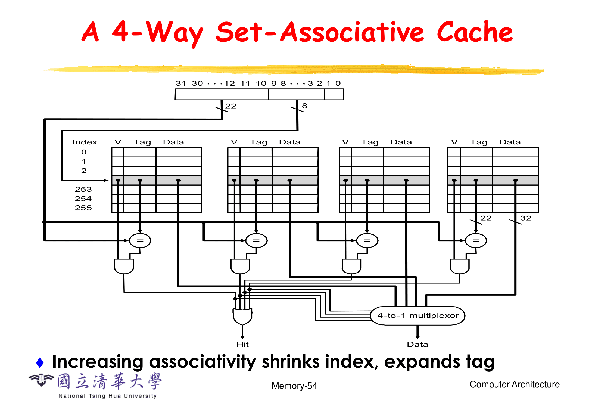
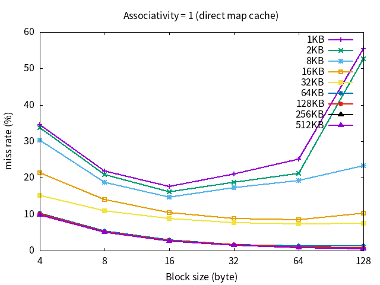
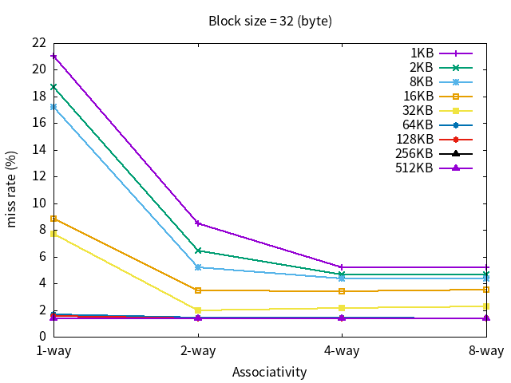

# Cache Simulator

## Usage

Build executable:

```bash
$ make build
```

Clean:

```bash
$ make clean
```

Generate plots:

```bash
$ make plot
```

Execute or Run:

```bash
$ ./cache -f {case filename} -c {cache size (KB)} -b {block size(B)} -a {associativity} -p {plot filename} -s
```

- `-s`: output slient

## Tips

可以参考黄婷婷教授的投影片 [05-Memory](../Lecture-Slides/05-Memory.pdf) P48 ~ P57 补足理论知识。



Clang format is based on LLVM style with identwidth equal 4.

输出时需要注意，需要将 `cout` 输出流的整数进制改为十进制 `cout << dec`，因为之前在读取地址时使用了十六进制 `cout << hex << x << " ";`。

Makefile 的一些解释:

- `--std=c++14`: 指定使用 C++14 标准进行编译。这表示编译器将遵循 C++14 标准的语法和特性。
- `-Wall`: 启用所有常见的警告信息。编译器将提供关于代码中潜在问题的警告。
- `-Wextra`: 启用额外的警告。这些警告涵盖了一些不常见的问题，可以帮助提高代码质量。
- `-Wconversion`: 启用隐式类型转换的警告。编译器将警告可能导致数据丢失或精度问题的类型转换。

## Draw

使用 gnuplot 生成折线图:




